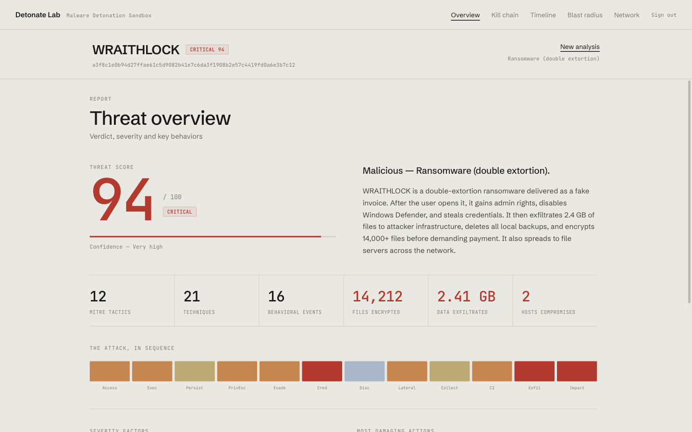
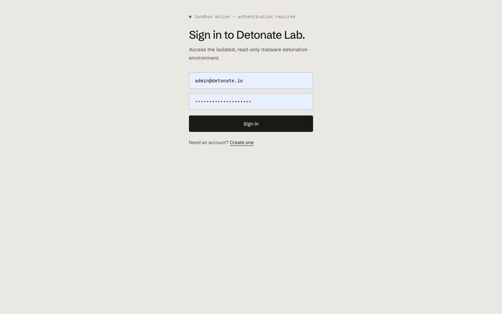
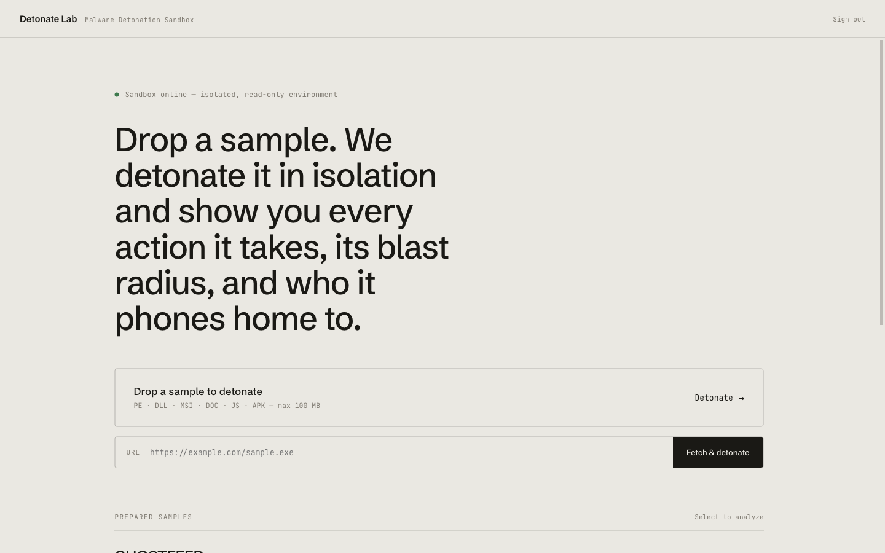
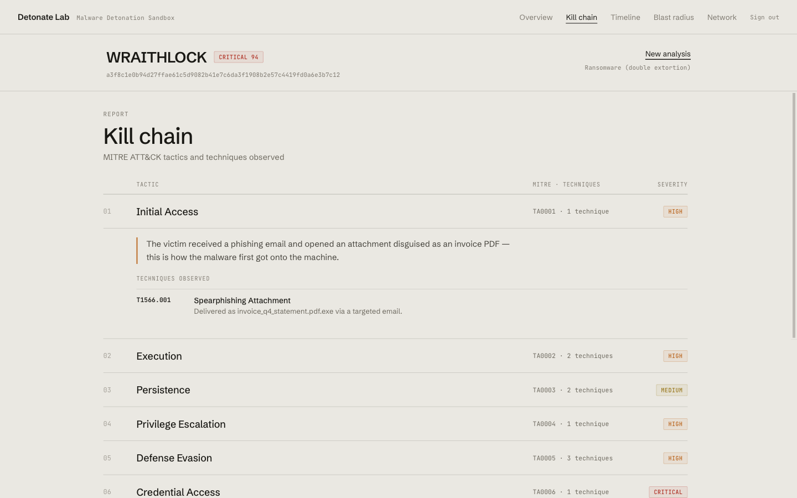
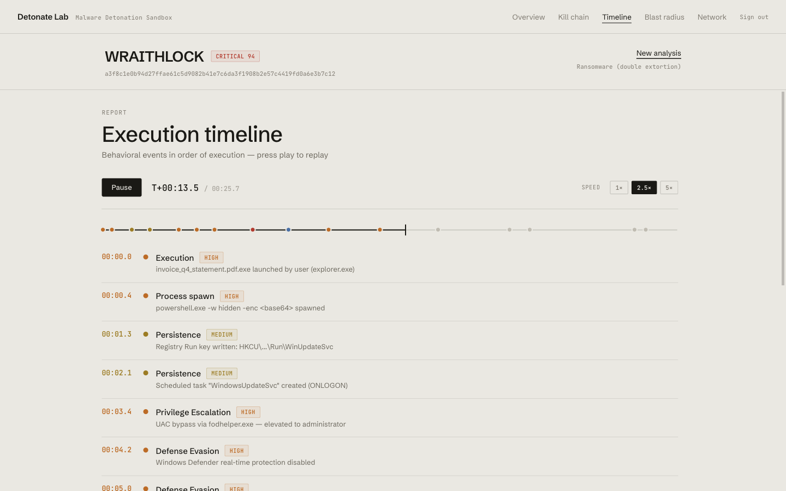
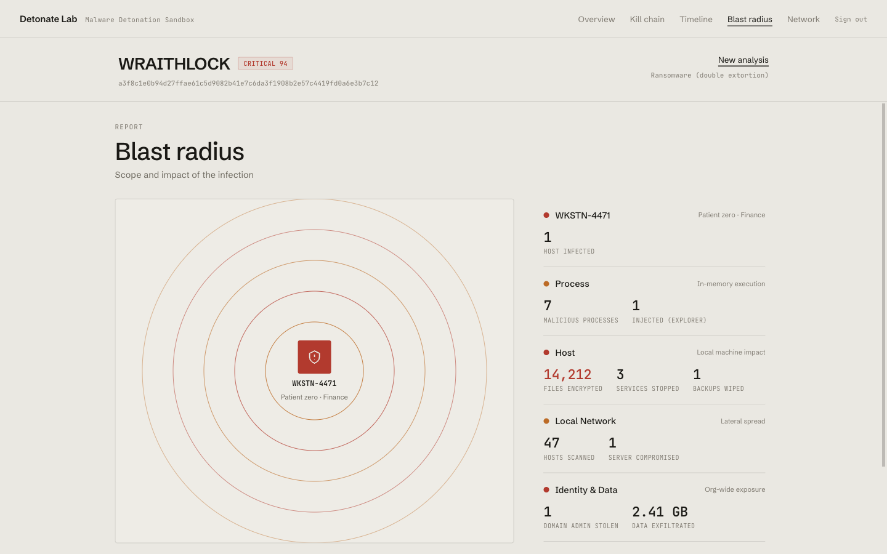
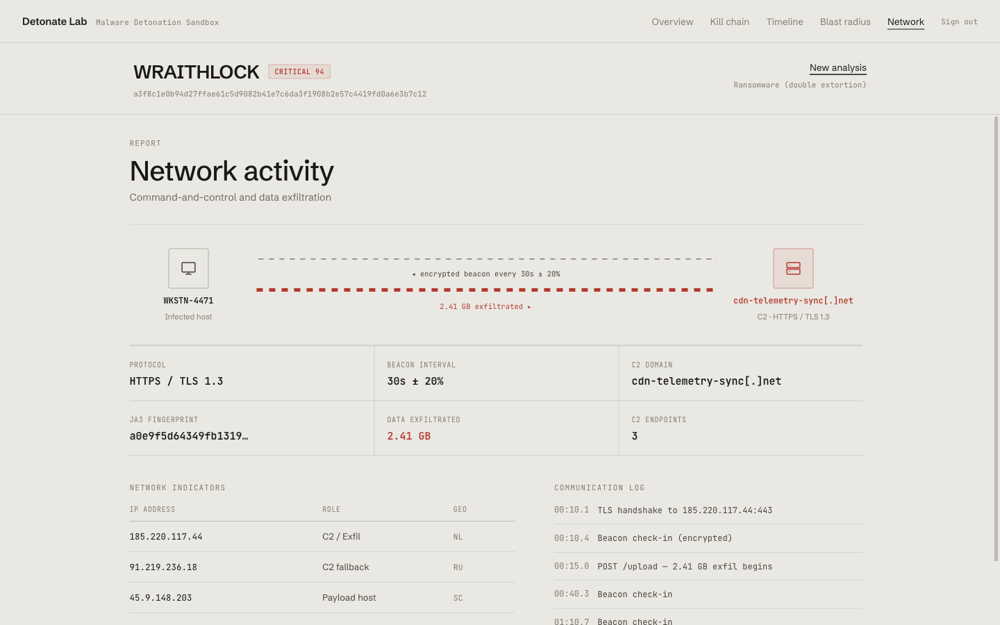
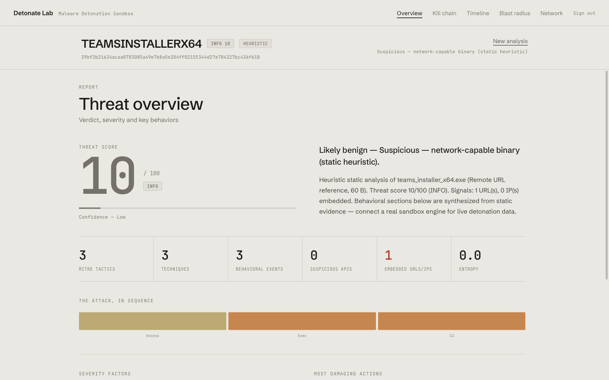

<div align="center">

# 🧨 Detonate Lab

### Malware Detonation Sandbox — submit a sample, see every action it takes, its blast radius, and who it phones home to.

[](docker-compose.yml)
[](backend/)
[](frontend/)
[](docker-compose.yml)
[](LICENSE)

A full-stack web app that ships as a single `docker compose up` and drops into any host.

</div>



---

## What is this?

**Detonate Lab** is a malware-analysis report platform. You submit a sample — by file upload
or URL — and the lab runs it through an analysis pipeline and renders a rich, readable report:
a threat score, the MITRE ATT&CK kill chain, a playable execution timeline, an animated blast
radius, and the command-and-control / data-exfiltration picture.

It comes up with **one command**, is **secured by default**, and is built to be **deployed
seamlessly on any new Docker host** — no external services, no CDNs, no manual wiring.

> [!IMPORTANT]
> **On "detonation."** Real dynamic detonation of live malware requires isolated, instrumented
> VMs (CAPE/Cuckoo) with nested virtualization, which cannot ship safely inside a portable
> `docker compose`. So Detonate Lab does what it *can* do safely and honestly: **real static
> analysis** of every (never-executed, quarantined) upload, **heuristic scoring**, and a
> **pluggable sandbox interface** that synthesizes clearly-labelled (`HEURISTIC`) behavioral
> data. The two reference samples are rendered as full curated reports. See
> [How analysis works](#-how-analysis-works).

---

## ✨ Features

- 🎯 **Threat report** — 0–100 score, severity band, verdict, confidence, and key behaviors at a glance
- 🗺️ **MITRE ATT&CK kill chain** — every tactic & technique, with plain-English explanations
- ⏱️ **Execution timeline** — scrub or play back behavioral events in order, at 1×/2.5×/5×
- 💥 **Blast radius** — animated concentric impact rings with live-counting stats
- 🛰️ **Network activity** — C2 flow, beacon/exfil, IP indicators, JA3, and a comms log
- 📥 **Submit anything** — drag-and-drop file upload or fetch-by-URL, up to 100 MB
- 🔬 **Real static analysis** — SHA-256, magic-byte typing, Shannon entropy, PE imports, IOC & string extraction
- 🔐 **Secure by default** — auth, CSRF, strict CSP, rate limiting, non-root hardened containers
- 🐳 **One-command deploy** — `docker compose up`; schema + reference samples seeded automatically
- 🔌 **Pluggable engine** — drop in a real sandbox (CAPE/Cuckoo) by implementing one method

---

## 📸 Screenshots

<table>
  <tr>
    <td width="50%"><br/><sub><b>🔐 Authentication</b> — argon2 + httpOnly JWT cookies</sub></td>
    <td width="50%"><br/><sub><b>📥 Submit</b> — drop a file or fetch a URL</sub></td>
  </tr>
  <tr>
    <td><br/><sub><b>🗺️ Kill chain</b> — MITRE ATT&CK, expandable</sub></td>
    <td><br/><sub><b>⏱️ Timeline</b> — playable execution replay</sub></td>
  </tr>
  <tr>
    <td><br/><sub><b>💥 Blast radius</b> — animated impact rings</sub></td>
    <td><br/><sub><b>🛰️ Network</b> — C2 & exfiltration</sub></td>
  </tr>
  <tr>
    <td colspan="2"><br/><sub><b>🔬 Heuristic analysis of a user-submitted sample</b> — real static features, scored and labelled <code>HEURISTIC</code></sub></td>
  </tr>
</table>

---

## 🚀 Quick start

```bash
git clone <your-repo-url> detonate-lab && cd detonate-lab

./scripts/init-env.sh          # generates .env with strong secrets + a bootstrap admin
docker compose up -d --build   # build & launch db + backend + web

# open the printed URL (default http://localhost:8080) and sign in with the
# admin credentials that init-env.sh printed.
```

`init-env.sh` prints the generated admin email/password. Self-service registration is also
enabled by default, and the first account created becomes an admin. The database schema and the
two reference samples (**WRAITHLOCK**, **GHOSTFEED**) are seeded automatically on first start.

<details>
<summary><b>Prefer to configure manually?</b></summary>

```bash
cp .env.example .env
# fill in POSTGRES_PASSWORD and DL_SECRET_KEY (openssl rand -hex 32), then:
docker compose up -d --build
```

In `production` mode the backend **refuses to start** without a strong, unique `DL_SECRET_KEY`,
so an insecure instance can't be shipped by accident.
</details>

### Make targets

```bash
make init    # generate .env          make logs   # tail logs
make up      # build + start          make ps     # service status
make down    # stop                   make test   # run backend tests
make nuke    # stop + wipe volumes
```

---

## 🧠 How analysis works

```
submit (file | url)
   └─ Analysis row created (status=queued)  ──▶  asyncio background job
         1. static analysis     → SHA-256, size, magic-byte type, entropy,
                                   PE imports, printable strings, IOCs        (REAL · safe)
         2. heuristic scoring    → 0–100 score, severity band, factors
         3. progress animation   → stage lines + % persisted per step (polled by the UI)
         4. resolve report:
              · known SHA  → curated reference report
              · otherwise  → sandbox.detonate() → synthesized, HEURISTIC-labelled report
         5. status=completed, full report stored
```

- **Uploaded files are never executed.** They are streamed to a dedicated quarantine volume as
  inert `<uuid>.bin` blobs (`0600`), and only *read* (hashing, entropy, magic bytes, strings).
- **Reference samples** (WRAITHLOCK, GHOSTFEED) render as full curated reports. Uploading a file
  whose SHA-256 matches a reference resolves to that report.
- **Anything else** is scored from its real static features and given a synthesized, clearly
  **`HEURISTIC`**-tagged behavioral report so the UI is fully populated.

### 🔌 Add a real sandbox

Implement the `Sandbox` protocol in [`backend/app/analysis/sandbox.py`](backend/app/analysis/sandbox.py) and return it from `get_sandbox()`:

```python
class CapeSandbox:
    name = "cape"
    def detonate(self, path, feats, score, *, display) -> dict:
        # submit to your instrumented VM, then return:
        return {"killchain": [...], "timeline": [...], "blast": [...], "network": {...}}
```

Nothing else changes — scoring, progress, storage and the UI are all engine-agnostic.

---

## 🏗️ Architecture

```
┌──────────────────────────────────────────────────────────────────────┐
│  web (nginx :8080)         backend (FastAPI :8000)      db (Postgres)  │
│  · serves the SPA     ──▶  · auth (argon2 + JWT)   ──▶  · users        │
│  · /api reverse proxy      · upload quarantine          · analyses     │
│  · security headers        · static analysis +            (report JSON)│
│  · rate limiting             heuristic scoring                          │
│  [ published ]             [ internal only ]           [ internal only ]│
└──────────────────────────────────────────────────────────────────────┘
```

| Service | Stack | Exposed | Role |
|---|---|---|---|
| `web` | nginx (unprivileged, non-root) | host `:WEB_PORT` → `8080` | Serves the SPA, reverse-proxies `/api`, security headers, rate limiting |
| `backend` | FastAPI · gunicorn/uvicorn (non-root) | internal `8000` | Auth, submissions, analysis engine, REST API |
| `db` | postgres:16-alpine | internal `5432` | Users + analyses (report stored as JSON) |

Only `web` is published; `backend` and `db` live on the internal Docker network. Full details in
**[docs/ARCHITECTURE.md](docs/ARCHITECTURE.md)**.

**Tech:** React 19 · Vite · TypeScript · FastAPI · SQLAlchemy 2 (async) · PostgreSQL 16 · nginx ·
self-hosted fonts (no CDN).

---

## ⚙️ Configuration

All configuration is environment-driven (`.env`). No secret is ever hard-coded.

| Variable | Default | Purpose |
|---|---|---|
| `POSTGRES_USER` / `POSTGRES_PASSWORD` / `POSTGRES_DB` | `detonate` / — / `detonate` | Database credentials (password required) |
| `DL_SECRET_KEY` | — | JWT signing key; **required** in production (`openssl rand -hex 32`) |
| `DL_ENVIRONMENT` | `production` | `production` enforces secret strength & hides API docs |
| `DL_ALLOW_REGISTRATION` | `true` | Allow self-service signups |
| `DL_COOKIE_SECURE` | `false` | Set `true` when serving over HTTPS |
| `DL_ADMIN_EMAIL` / `DL_ADMIN_PASSWORD` | — | Optional bootstrap admin created on first start |
| `WEB_PORT` | `8080` | Host port for the UI |
| `WEB_CONCURRENCY` | `2` | Backend worker processes |

---

## 🔒 Security

Detonate Lab handles untrusted, potentially malicious uploads, so security is first-class:

- **Auth** — argon2id password hashing; stateless JWT in an **httpOnly**, `SameSite=Strict` cookie
- **CSRF** — double-submit token required on every state-changing request
- **Authorization** — object-level scoping: users see only their own analyses + shared samples (admins see all)
- **Brute force** — per-IP+email login throttle *and* nginx rate limiting on auth endpoints
- **Uploads** — never executed; streamed to a quarantine volume with a hard size cap; filenames sanitized
- **Headers** — strict CSP (`default-src 'self'`, no CDNs — fonts self-hosted), `X-Frame-Options: DENY`, `nosniff`, `Referrer-Policy`, `Permissions-Policy`
- **Containers** — non-root everywhere; backend runs `cap_drop: ALL`, read-only rootfs, `no-new-privileges`
- **No injection** — SQLAlchemy ORM only; React auto-escaping; Pydantic-validated inputs
- **Fail closed** — production won't start without a strong `DL_SECRET_KEY`

Full threat model and operator responsibilities in **[docs/SECURITY.md](docs/SECURITY.md)**.

---

## 🌐 Production / HTTPS

The app is same-origin and TLS-ready. Terminate TLS at your platform's load balancer / ingress
(or a TLS proxy in front of `web`), then:

1. set `DL_COOKIE_SECURE=true` in `.env`,
2. uncomment the `Strict-Transport-Security` header in [`frontend/nginx.conf`](frontend/nginx.conf),
3. point the proxy at `web:8080`.

`SameSite=Strict` cookies plus the double-submit CSRF token protect state-changing requests regardless.

---

## 🧪 Testing

```bash
make test            # spins up backend/.venv and runs pytest
# or:
cd backend && python3 -m venv .venv && . .venv/bin/activate \
  && pip install -r requirements-dev.txt && pytest -q
```

Covers static analysis, heuristic scoring, the sandbox synthesizer, report assembly/schema, the
full auth + submission flow, CSRF enforcement, and tenant isolation.

---

## 🛠️ Local development

```bash
# Backend (hot reload, SQLite — no Postgres needed)
cd backend && python3 -m venv .venv && . .venv/bin/activate
pip install -r requirements-dev.txt
DL_ENVIRONMENT=development DL_SECRET_KEY=dev-only-secret-please-change-32xx \
  DL_DATABASE_URL=sqlite+aiosqlite:///./dev.db DL_COOKIE_SECURE=false \
  uvicorn app.main:app --reload

# Frontend (proxies /api → http://localhost:8000)
cd frontend && npm install && npm run dev
```

---

## 📁 Project structure

```
detonate-lab/
├── docker-compose.yml          # single-file orchestration: db + backend + web
├── .env.example                # configuration template
├── scripts/init-env.sh         # generate .env with strong secrets
├── backend/                    # FastAPI app
│   ├── app/
│   │   ├── main.py  config.py  db.py  models.py  schemas.py  security.py  deps.py  seed.py
│   │   ├── routers/            # auth · analyses · health
│   │   └── analysis/           # static_analysis · scoring · sandbox · engine · seed_data
│   ├── tests/                  # pytest suite
│   └── Dockerfile
├── frontend/                   # React + Vite + TS SPA
│   ├── src/
│   │   ├── App.tsx  main.tsx  index.css
│   │   ├── lib/                # api · auth · theme · types
│   │   └── components/         # Topbar · AuthScreen · ImportView · AnalyzingView · AppView · tabs/
│   ├── nginx.conf              # edge: SPA + /api proxy + security headers + rate limit
│   └── Dockerfile
└── docs/                       # ARCHITECTURE.md · SECURITY.md · screenshots/
```

---

## 📄 License

[MIT](LICENSE) © 2026 Detonate Lab
